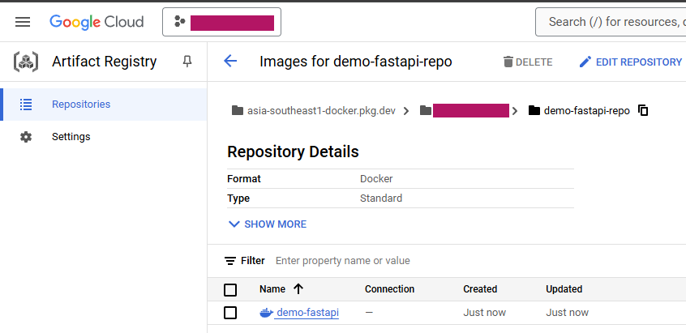

# FastAPI on GCP Cloud Run

Little project to explore a FastAPI deployment on Google Cloud Project.

On this project, we will deploy a dockerized FastAPI application to Cloud Run.

## Requirements
1. Install [Python](https://www.python.org/)
2. [Docker](https://www.docker.com/)
3. [Google Cloud Project](https://cloud.google.com/) account
4. Install [Google Cloud CLI](https://cloud.google.com/sdk/docs/install)

## Setup project

```bash
# Clone project
$ git clone https://github.com/mel-cdn/gcp-fastapi-cloud-run
$ cd gcp-fastapi-cloud-run

# Build the FastAPI docker image (completion time may vary depending on your internet speed)
$ docker build -t fastapi-docker .

# Run the container
$ docker run -p 8000:80 fastapi-docker
INFO:     Started server process [1]
INFO:     Waiting for application startup.
INFO:     Application startup complete.
INFO:     Uvicorn running on http://0.0.0.0:80 (Press CTRL+C to quit)

# Open a new terminal and test if the FastAPI app works!
$ curl http://localhost:8000
{"message":"Hello from GCP!"}
```

## Setup Google Cloud CLI
```bash
# Follow instructions to authenticate your GCP account (if not done yet)
$ gcloud init

# Make sure you to set your default project
$ gcloud config set project <YOUR-GCP-ID>
Updated property [core/project].
```

## Deploy Docker image to Cloud Run
```bash
# Setup configs
PROJECT_ID=<YOUR-GCP-ID>
REGION=asia-southeast1
TAG=$REGION-docker.pkg.dev
DOCKER_REPO=demo-fastapi-repo
DOCKER_IMAGE=demo-fastapi

# Enable Artifact Register
$ gcloud services enable artifactregistry.googleapis.com

# Authenticate to Artifact Registry
$ gcloud auth configure-docker $TAG
Docker configuration file updated.

# Create a Docker repository in Artifact Registry
$ gcloud artifacts repositories create $DOCKER_REPO \
 --repository-format=docker \
 --location=$REGION
Create request issued for: [demo-fastapi-repo]
Waiting for operation [projects/PROJECT_ID/locations/asia-southeast1/operations/49cfdf0a-b727-4e36-893f-f1bb275567d2] to complete...done.                                                                                       
Created repository [demo-fastapi-repo].

# Build the FastAPI Docker image with appropriate tag this time
$ docker build -t $TAG/$PROJECT_ID/$DOCKER_REPO/$DOCKER_IMAGE .

# Push the image to Artifact Registry
$ docker push $TAG/$PROJECT_ID/$DOCKER_REPO/$DOCKER_IMAGE
...
f5fe472da253: Pushed
latest: digest: sha256:d8d93db647006208e47423ee8cf8477b4b95b1f440256ad3517334765e2d6847 size: 1991
```
At this point, you may take a look on Google Cloud Console to see the deployed image.
    <details>
    <summary>Docker image in Artifact Registry (click to view)</summary>
    
    </details>
